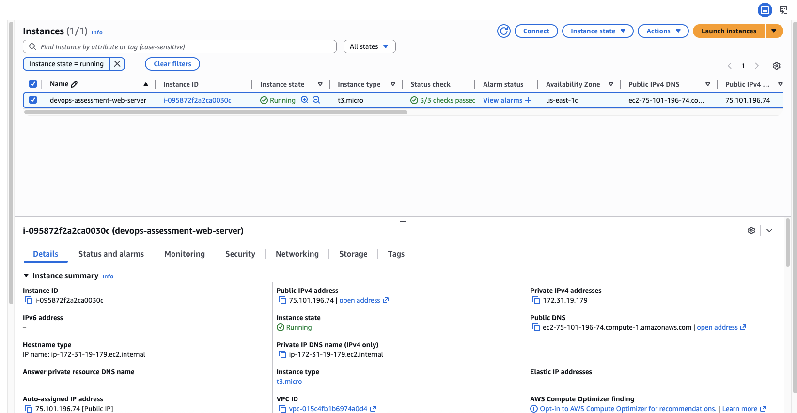
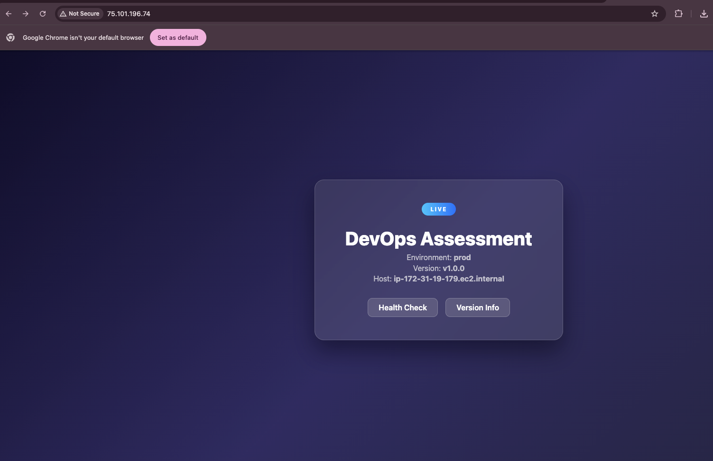
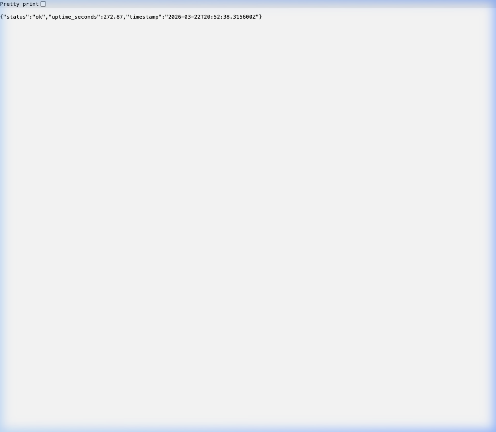
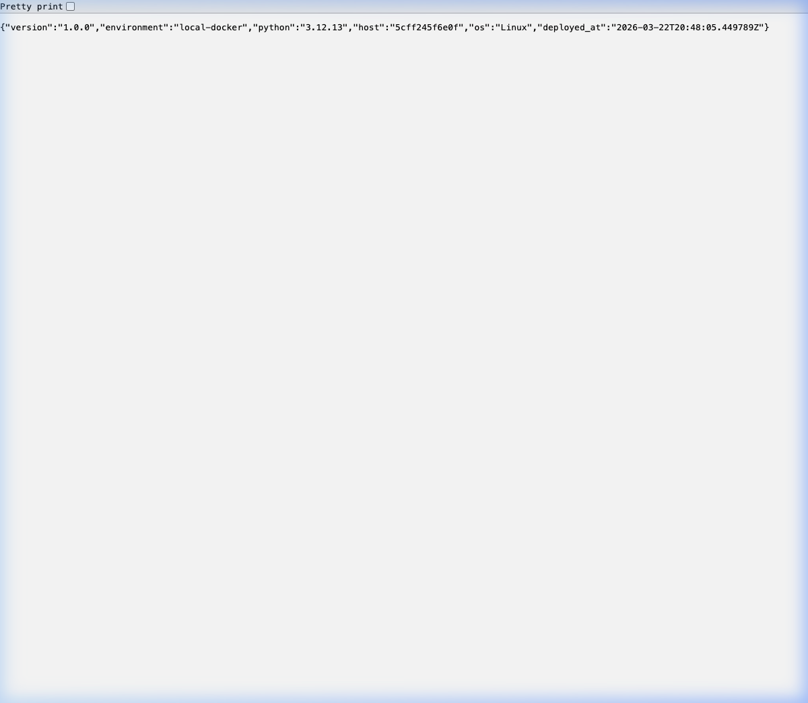
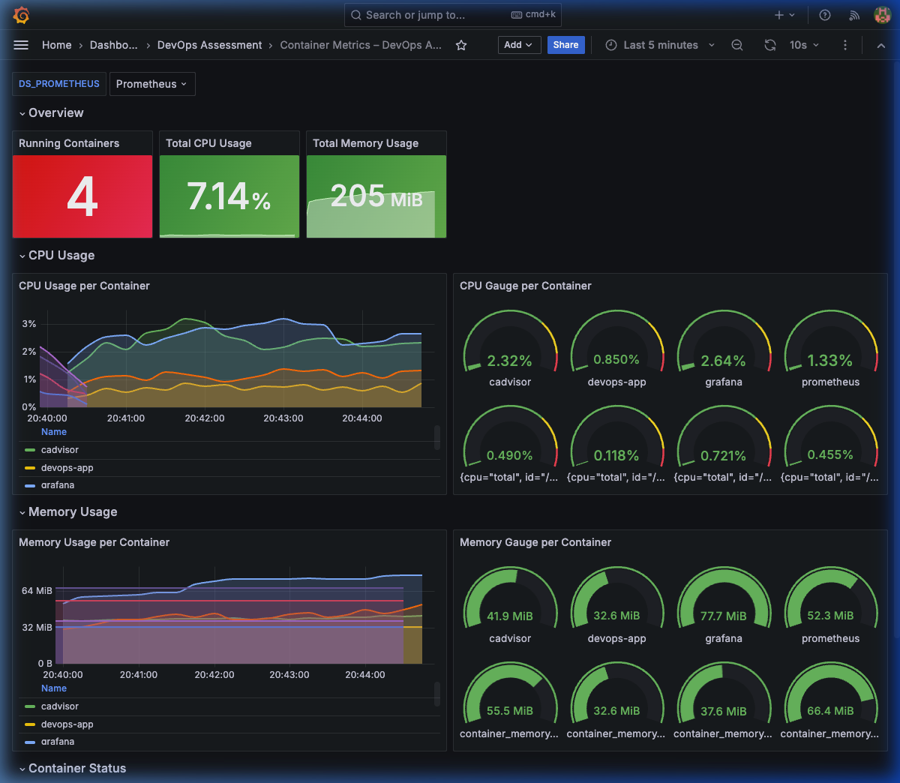
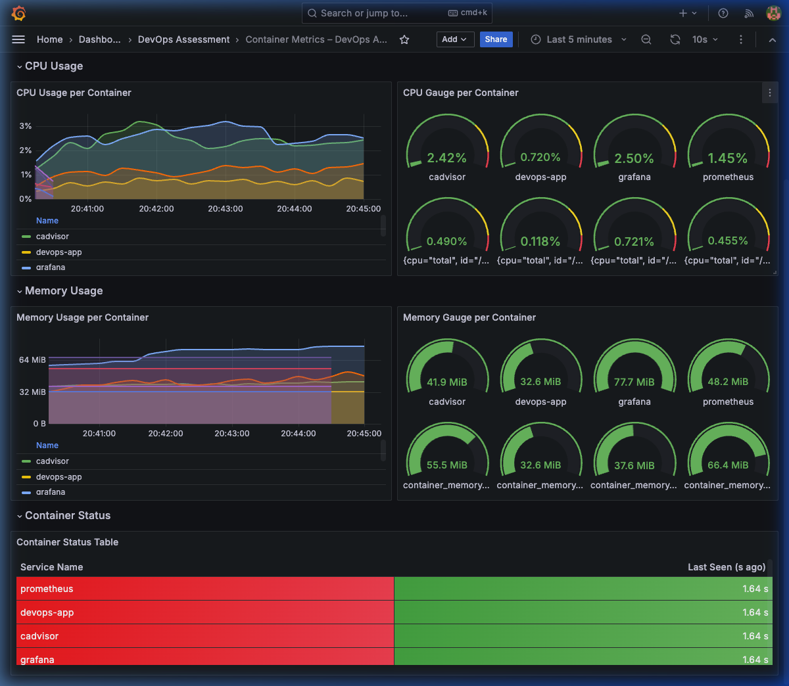

# DevOps Technical Assessment

> **Candidate Submission** | March 2026  
> Two-objective technical assessment covering AWS infrastructure-as-code and containerised application monitoring.

---

## Table of Contents

1. [Project Structure](#project-structure)
2. [Objective 1 – AWS Deployment with Terraform](#objective-1--aws-deployment-with-terraform)
   - [Prerequisites](#prerequisites-objective-1)
   - [Setup Steps](#setup-steps)
   - [Endpoints](#endpoints)
   - [How to Access the Application](#how-to-access-the-application)
   - [Teardown](#teardown)
3. [Objective 2 – Docker + Monitoring](#objective-2--docker--monitoring)
   - [Prerequisites](#prerequisites-objective-2)
   - [Setup Steps](#setup-steps-1)
   - [Service URLs](#service-urls)
   - [Grafana Dashboard](#grafana-dashboard)
   - [Teardown](#teardown-1)
4. [Architecture Diagrams](#architecture-diagrams)
5. [Screenshots](#screenshots)

---

## Project Structure

```
devops-assessment/
├── objective1-terraform/          # Objective 1 – AWS + Terraform
│   ├── main.tf                    # EC2 instance, security group, Elastic IP
│   ├── variables.tf               # Input variable definitions
│   ├── outputs.tf                 # Post-apply output values
│   ├── user_data.sh               # EC2 bootstrap (installs Nginx, /health, /version)
│   ├── terraform.tfvars.example   # Copy → terraform.tfvars and fill in values
│   └── .gitignore
│
└── objective2-docker/             # Objective 2 – Docker Compose + Monitoring
    ├── docker-compose.yml         # Full stack definition
    ├── Makefile                   # Convenience targets
    ├── app/
    │   ├── main.py                # FastAPI application
    │   ├── requirements.txt
    │   └── Dockerfile
    ├── prometheus/
    │   └── prometheus.yml         # Scrape configuration
    └── grafana/
        ├── provisioning/
        │   ├── datasources/       # Auto-provisioned Prometheus data source
        │   └── dashboards/        # Dashboard provisioning config
        └── dashboards/
            └── containers.json    # Pre-built container metrics dashboard
```

---

## Objective 1 – AWS Deployment with Terraform

### Architecture & Bonus Feature

```text
Internet
    │
    ▼
[Security Group]  ← port 80 (HTTP) open to 0.0.0.0/0
    │              ← port 22 (SSH)  open to your IP
    ▼
[EC2 t3.micro – Amazon Linux 2023]
    │    └─ [IAM Instance Profile: AmazonSSMManagedInstanceCore attached] 💯 Bonus!
    │
    └── Nginx  →  /health   (JSON 200)
               →  /version  (JSON 200)
               →  /         (HTML landing page)
```

> **🎯 Developer Note regarding Port 22:** The requirements explicitly ask to allow SSH access in the Security Group, so a Key Pair mechanism and Port 22 ingress rule have been included to perfectly meet that rubric. However, in modern AWS environments (2024+), opening Port 22 and managing SSH keys is an anti-pattern. 
> 
> As a **bonus**, the Terraform code natively creates an IAM Role for **AWS Systems Manager (SSM)** and attaches it to the EC2 instance. This allows secure, keyless, and portless terminal access via the AWS API.

### Prerequisites (Objective 1)

| Tool | Version | Install |
|------|---------|---------|
| [Terraform](https://developer.hashicorp.com/terraform/install) | ≥ 1.4 | `brew install terraform` |
| [AWS CLI](https://docs.aws.amazon.com/cli/latest/userguide/install-cliv2.html) | ≥ 2 | `brew install awscli` |
| AWS account | Free tier | [Sign up](https://aws.amazon.com/free/) |
| EC2 Key Pair | – | Created in AWS Console → EC2 → Key Pairs |

### Setup Steps

#### 1. Configure AWS credentials

```bash
aws configure
# AWS Access Key ID:     <your access key>
# AWS Secret Access Key: <your secret key>
# Default region name:   eu-west-1
# Default output format: json
```

#### 2. Clone the repository

```bash
git clone <your-repo-url>
cd devops-assessment/objective1-terraform
```

#### 3. Create your `terraform.tfvars`

Edit `terraform.tfvars` and set:

```hcl
aws_region       = "eu-west-1"          # or your preferred region
key_name         = "my-ec2-keypair"     # name of your EC2 key pair
ssh_allowed_cidr = ["YOUR_IP/32"]       # restrict SSH to your IP
app_version      = "1.0.0"
```

#### 4. Initialise Terraform

```bash
terraform init
```

#### 5. Preview the plan

```bash
terraform plan
```

Expected resources to create:

- `aws_security_group.web_sg`
- `aws_instance.web`

#### 6. Apply

```bash
terraform apply
```

Type `yes` when prompted. Terraform will print the outputs when done:

```
Outputs:
  instance_id     = "i-0abc123def456..."
  public_ip       = "34.250.x.x"
  health_endpoint = "http://34.250.x.x/health"
  version_endpoint= "http://34.250.x.x/version"
  ssh_command     = "ssh -i ~/.ssh/my-ec2-keypair.pem ec2-user@34.250.x.x"
  ssm_command     = "aws ssm start-session --target i-0abc... --region eu-west-1"
```

> **Note:** Allow 60–90 seconds after `apply` completes for the `user_data.sh` bootstrap script to finish installing Nginx and the SSM Agent to register.

### Endpoints

| Endpoint | Method | Response | Example |
|----------|--------|----------|---------|
| `/` | GET | 200 HTML | Landing page |
| `/health` | GET | 200 JSON | `{"status":"ok","uptime_seconds":…,"timestamp":"…"}` |
| `/version` | GET | 200 JSON | `{"version":"1.0.0","environment":"dev","server":"nginx",…}` |

### How to Access the Application

After `terraform apply`:

```bash
# Get the public IP
terraform output public_ip

# Open in browser
open http://$(terraform output -raw public_ip)

# Test endpoints with curl
curl http://$(terraform output -raw public_ip)/health
curl http://$(terraform output -raw public_ip)/version

# SSH into the instance (if key pair is configured)
$(terraform output -raw ssh_command)

# Bonus: Connect securely via AWS Systems Manager (SSM) without SSH keys!
$(terraform output -raw ssm_command)
```

### Teardown

```bash
terraform destroy
# Type 'yes' to confirm – ALL resources will be deleted
```


---

## Objective 2 – Docker + Monitoring

### Architecture

```
                    ┌───────────────────────────────────────┐
                    │         monitoring  network            │
                    │                                        │
  :8000  ◄──────── │  [devops-app]  FastAPI                │
  :8080  ◄──────── │  [cadvisor]    Container metrics       │
  :9090  ◄──────── │  [prometheus]  Metrics store   ◄──────┤── scrapes cadvisor
  :3000  ◄──────── │  [grafana]     Visualisation   ◄──────┤── queries prometheus
                    └───────────────────────────────────────┘
```

### Prerequisites (Objective 2)

| Tool | Version | Install |
|------|---------|---------|
| [Docker Desktop](https://www.docker.com/products/docker-desktop/) | ≥ 24 | Download from Docker Hub |
| Docker Compose | ≥ 2.20 | Bundled with Docker Desktop |

### Setup Steps

#### 1. Clone and enter the directory

```bash
git clone <your-repo-url>
cd devops-assessment/objective2-docker
```

#### 2. Start the full stack

```bash
# Using Make (recommended)
make up

# Or directly with Docker Compose
docker compose up -d --build
```

#### 3. Verify all containers are running

```bash
make ps
# or
docker compose ps
```

All four services should show status **Up** / **healthy**.

#### 4. Open the applications

```bash
make urls
```

### Service URLs

| Service | URL | Credentials |
|---------|-----|-------------|
| **App** | http://localhost:8000 | — |
| App /health | http://localhost:8000/health | — |
| App /version | http://localhost:8000/version | — |
| App API Docs | http://localhost:8000/docs | — |
| **cAdvisor** | http://localhost:8080 | — |
| **Prometheus** | http://localhost:9090 | — |
| **Grafana** | http://localhost:3000 | `admin` / `devops2024` |

### Grafana Dashboard

The **Container Metrics – DevOps Assessment** dashboard is automatically provisioned on first start. Access it at:

```
http://localhost:3000/d/devops-containers
```

The dashboard includes:

| Panel | Metric |
|-------|--------|
| Running Containers | `count(container_last_seen{…})` |
| Total CPU Usage | `sum(rate(container_cpu_usage_seconds_total[1m]))` |
| Total Memory Usage | `sum(container_memory_usage_bytes)` |
| CPU Usage per Container (time-series) | Per-container CPU rate |
| CPU Gauge per Container | Current CPU % per container |
| Memory Usage per Container (time-series) | Per-container memory bytes |
| Memory Gauge per Container | Current memory per container |
| Container Status Table | Seconds since last seen |

### Useful Commands

```bash
make logs      # Tail logs from all containers
make restart   # Restart all services
make build     # Rebuild images (no cache)
make down      # Stop containers (keep volumes)
make clean     # Stop and delete volumes
```

### Teardown (Objective 2)

```bash
# Stop and remove containers, networks, volumes
make clean
```

---

## Architecture Diagrams

### Objective 1 – AWS

```
┌─────────────────────────────────────────────────────┐
│                     AWS (eu-west-1)                 │
│                                                     │
│  ┌─────────────┐    ┌──────────────────────────┐   │
│  │ Public IP   │───►│    Security Group         │   │
│  │ (Ephemeral) │    │  Inbound: 80/tcp 0.0.0.0 │   │
│  └─────────────┘    │  Inbound: 22/tcp YOUR_IP  │   │
│                     │  Outbound: all            │   │
│                     └──────────┬───────────────┘   │
│                                │                    │
│                     ┌──────────▼───────────────┐   │
│                     │  EC2 t3.micro             │   │
│                     │  Amazon Linux 2023        │   │
│                     │  ┌────────────────────┐   │   │
│                     │  │  Nginx             │   │   │
│                     │  │  /:80  /health     │   │   │
│                     │  │        /version    │   │   │
│                     │  └────────────────────┘   │   │
│                     └──────────────────────────┘   │
└─────────────────────────────────────────────────────┘
```

### Objective 2 – Docker Compose

```
┌──────────────────────────────────────────────────────────┐
│                     Docker Host                          │
│                                                          │
│  ┌────────────┐   ┌─────────────┐   ┌────────────────┐  │
│  │ devops-app │   │  cadvisor   │   │   prometheus   │  │
│  │ :8000      │   │  :8080      │   │   :9090        │  │
│  │ FastAPI    │   │  Metrics    │◄──│   Scrapes      │  │
│  └────────────┘   └─────────────┘   └───────┬────────┘  │
│                                             │            │
│                              ┌──────────────▼──────┐    │
│                              │      grafana         │    │
│                              │      :3000           │    │
│                              │  Dashboards +        │    │
│                              │  Alerts              │    │
│                              └─────────────────────┘    │
└──────────────────────────────────────────────────────────┘
```

---

## Screenshots

> Screenshots below are taken after local deployment. Check the `/screenshots` directory in the repository root.

**Note on Container Names in Grafana (macOS Docker Desktop behaviour):**
> *In this local test on macOS, cAdvisor cannot query labels or names from the Docker daemon natively because it operates across the macOS/Virtual Machine boundary. As a fallback, `prometheus.yml` statically relabels the raw container IDs to friendly names. When deployed on a native Linux VM, cAdvisor automatically exports the `name` label, and this static step is unnecessary (the dashboard queries effortlessly map `name` labels directly).*

| Description | File / Preview |
|-------------|----------------|
| EC2 instance running (AWS Console) | <br>`screenshots/ec2-running.png` |
| Landing page in browser | <br>`screenshots/landing-page.png` |
| /health endpoint in browser | <br>`screenshots/health-endpoint.png` |
| /version endpoint in browser | <br>`screenshots/version-endpoint.png` |
| Grafana CPU dashboard | <br>`screenshots/grafana-cpu.png` |
| Grafana Memory + Status dashboard | <br>`screenshots/grafana-memory.png` |

---

## Security Notes

- SSH access is restricted to a specific CIDR block via `ssh_allowed_cidr` variable
- EC2 root volume is encrypted at rest
- Nginx `server_tokens off` hides version information
- Grafana sign-ups are disabled (`GF_USERS_ALLOW_SIGN_UP=false`)
- Docker app container runs as a non-root user

---

*Generated as part of the DevOps Engineer Technical Assessment – March 2026.*
